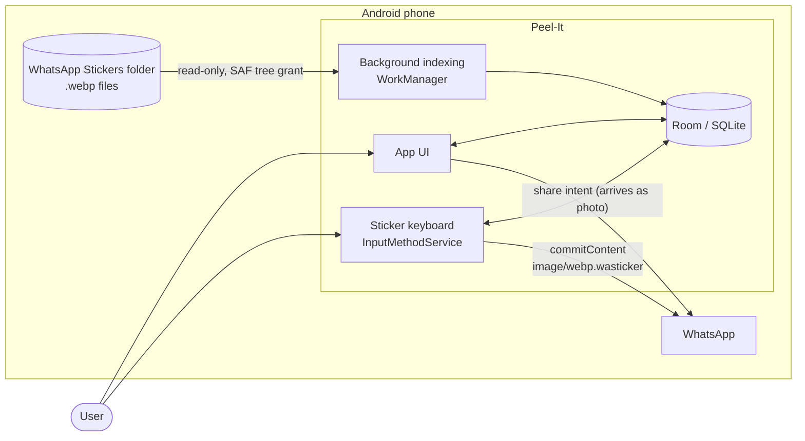
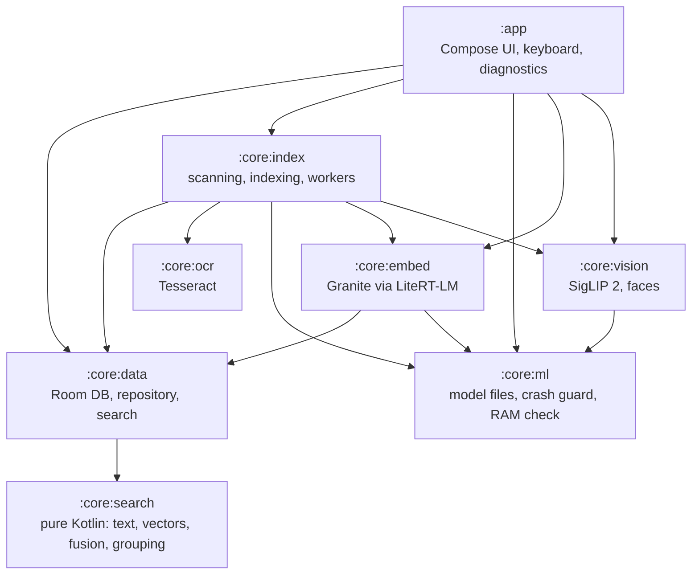
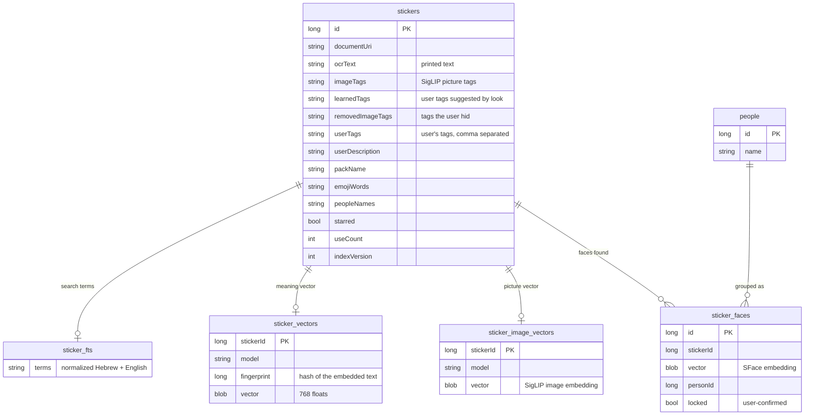
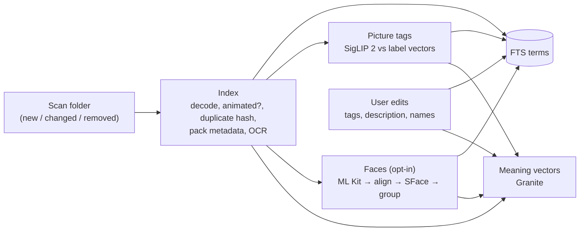
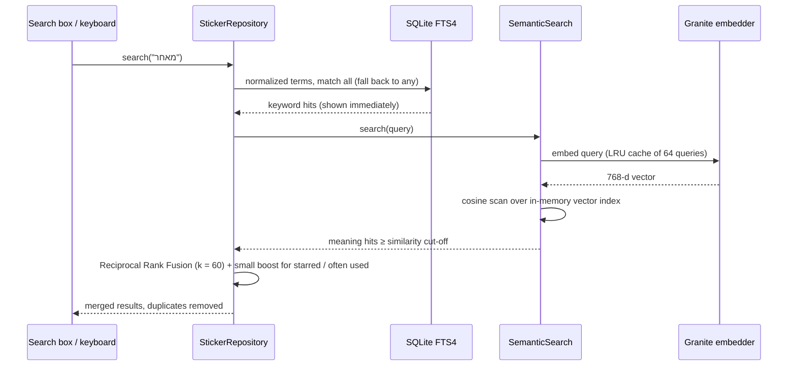
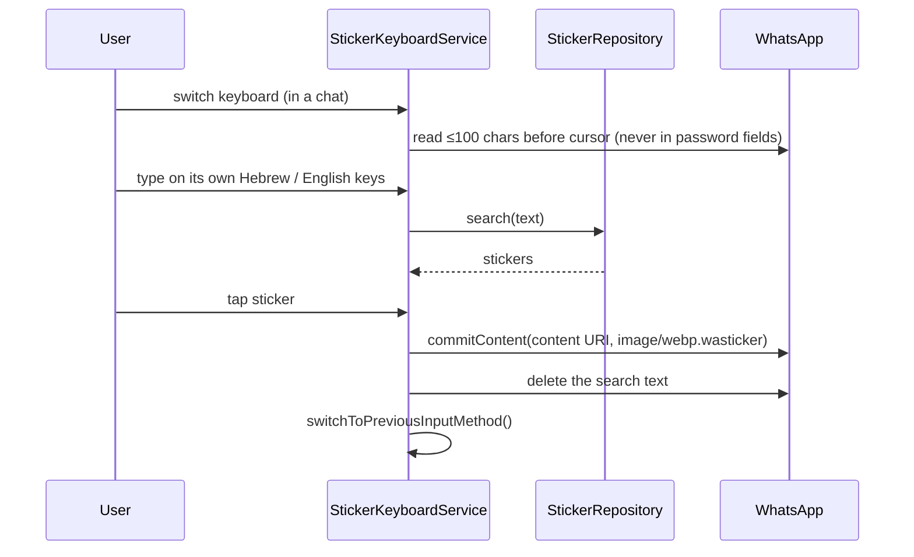
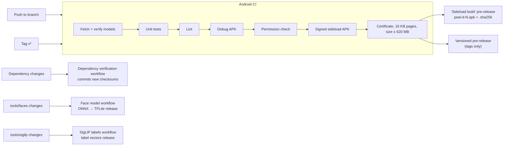

# Peel-It: Architecture

Peel-It finds the right WhatsApp sticker among thousands, in Hebrew or English, entirely on the
phone. This document describes how it is built and why. For the history and roadmap see
[DEVELOPMENT_PLAN.md](DEVELOPMENT_PLAN.md); for privacy see [PRIVACY.md](../PRIVACY.md).

Diagrams use Mermaid (GitHub renders them).

## 1. Goals and constraints

| Goal / constraint | Consequence in the design |
|---|---|
| **Nothing leaves the phone** | No `INTERNET` permission, enforced in CI on the final APK. All models run on-device and ship inside the APK. |
| **Hebrew and English, mixed** | Custom text normalization (prefixes, niqqud, slang) for keywords; a multilingual embedding model for meaning. |
| **~10,000 stickers, a few seconds per search at most** | Everything expensive happens once, at index time; a search is a SQLite FTS query plus an in-memory vector scan. |
| **Battery** | Heavy work (picture tags, faces, embeddings) waits for the charger; the user's own edits run right away. |
| **Easy install, mid-range phones** | One signed APK (arm64, Android 11+), models bundled, no setup beyond picking the stickers folder. |
| **Biometric data is sensitive** | Face grouping is opt-in, stays on the phone, is excluded from backups and can be deleted in one tap. |
| **Robust to bad input** | A sticker that crashes native code is retried alone and eventually skipped; a model that crashes the app is turned off automatically. |

## 2. System context

The app never writes to the stickers folder and never talks to a network. WhatsApp is reached
only through Android's standard keyboard-content and share APIs.

## 3. Modules

| Module | Responsibility | Notable dependencies |
|---|---|---|
| `:app` | Screens (search, sticker details, Smart search, People, keyboard setup, quality test, About), the sticker keyboard, diagnostics, theme and branding | Compose Material 3, WorkManager |
| `:core:search` | Pure JVM, no Android: Hebrew/English normalization, prefixes, stop words, synonyms, FTS query building, vector math, Reciprocal Rank Fusion, face grouping (Chinese whispers), evaluation metrics | none (fast unit tests) |
| `:core:data` | Room database (v10, migrations 1→10), DAO, `StickerRepository` (search, edits, sharing edits), `SemanticSearch` | Room, KSP |
| `:core:index` | Folder access (SAF), scanner, `StickerIndexer`, sticker-pack metadata reader, workers for indexing, picture tags, faces and embeddings, power/battery policy | WorkManager |
| `:core:ocr` | Tesseract OCR (heb+eng, `tessdata_fast`), text cleanup, installs bundled language files | Tesseract4Android |
| `:core:vision` | SigLIP 2 image encoder and picture-tag labels; face detection (ML Kit) + alignment + SFace embeddings | LiteRT, ML Kit face detection |
| `:core:embed` | Granite multilingual text embedder, one instance per process (`EmbedderHolder`) | LiteRT-LM |
| `:core:ml` | Model catalog and pinned hashes, importing model files, the bundled Granite installer, `ModelCrashGuard`, RAM checks | — |

Dependencies point inward: `:core:search` knows nothing about Android, `:core:data` knows nothing
about models or workers, and only `:app` and `:core:index` assemble the pieces.

## 4. Data model

- **`stickers`** is the source of truth. Every field that feeds search is plain text so it can be
  edited, shown and re-indexed.
- **`sticker_fts`** (FTS4) holds one normalized term string per sticker, rebuilt by
  `IndexTerms.build(...)` from OCR text, visible picture tags, user tags, pack name, emoji words,
  people names and the user's description.
- **`sticker_vectors`** stores the meaning vector with the model id and a fingerprint of the text
  it was made from, so a vector is recomputed only when that text or the model changes.
- **`sticker_image_vectors`** powers "looks similar" when editing a sticker.
- **Faces and people** are separate tables so deleting all face data is a simple wipe.
- **Versioning.** `IndexVersion` marks how far each sticker was processed (basic, OCR, pack
  metadata…). Raising a version re-processes only what that step needs.

## 5. Indexing pipeline

| Stage | Worker | When it runs | Notes |
|---|---|---|---|
| Scan + index (OCR, metadata) | `IndexWorker` | On app open (foreground job), daily otherwise; battery not low; 10-minute scan cooldown | One OCR reader per core; stickers that failed before run alone; after repeated failures OCR, then decoding, is skipped for that sticker |
| Picture tags | `ImageTagWorker` | While charging, or immediately via "Start now" | SigLIP 2 image vector compared with precomputed label vectors; name labels need a higher threshold (0.135) than general ones (0.10) |
| Faces | `FaceWorker` | While charging, only if People is on | Faces drawn on white, landmarks sorted by x, aligned to the ArcFace 112×112 template; grouping by nearest grouped face (≥0.5), else a kNN graph + Chinese whispers |
| Learned tags | `EmbedWorker`, before embedding | With every embedding pass; skipped when no tags or pictures changed | The user's tags spread to look-alike stickers (below); stored picture vectors only, no model |
| Meaning vectors | `EmbedWorker` | While charging for background changes; right away (battery not low) for user edits | At most one waiting pass; each pass embeds only stickers whose text fingerprint changed |

All workers run in bounded slices (`WorkBudget`) and reschedule themselves, so Android can stop
them at any time without losing progress.

**Learned tags.** The picture model only knows a fixed label list, so the user's own tags are
learned from their pictures (`LearnedTags` in `:core:search`, run by `LearnedTagger`). For each
tag, the picture vectors of the stickers that have it are averaged into a prototype, and a sticker
without the tag gets it when it is close enough. The threshold adapts to each tag: at least as
close as the tag's own least typical example (leave-one-out, minus 0.03), clearly above how alike
random stickers are (99th percentile + 0.05), and never below 0.6. Tags whose stickers look
nothing alike ("funny") are skipped, a tag on a single sticker spreads only to near-copies (≥ 0.9),
and each tag reaches at most 40 stickers, each sticker gets at most 3. Learned tags are
searchable like picture tags; in the sticker's details the user can make one their own (which
makes it an example too) or hide it for good.

**Sticker-pack metadata.** WhatsApp stickers carry a JSON note in the WebP EXIF chunk with the
pack name, publisher and emojis. `StickerMetadata` parses it without a JSON library, and
`EmojiWords` turns emojis into Hebrew and English words ("😂" → laughing, צוחק).

## 6. Search

- **Keyword side.** `QueryParser` and `FtsQueryBuilder` normalize the query the same way the
  index was built: niqqud removed, Hebrew prefixes (ו, ה, ב, ל, מ, ש, כ) expanded, synonyms and
  common slang added, stop words dropped.
- **Meaning side.** The vector index is loaded into memory once and reloaded only when the table's
  signature (count + checksum) changes. The similarity cut-off can be tuned from the in-app search
  quality test.
- **Fusion.** Rank-based, so the two sides don't need comparable scores. Without an embedding model
  the search is keyword-only.

**Similar stickers (sticker details).** "Looks similar" uses nearest picture vectors, "same context"
nearest meaning vectors, "same person" shared face groups, "same pack" the pack name. An edit shared
with them applies only what changed in that edit: tags added or removed, picture tags hidden or
restored, and the description.

## 7. Sticker keyboard

Stickers sent through the share sheet arrive in WhatsApp as photos; the keyboard route is the
only way for a third-party app to send a real sticker. Files are exposed through a non-exported
`FileProvider` with a one-off URI grant.

## 8. Models

| Model | Purpose | Size | How it ships | Runtime |
|---|---|---|---|---|
| SigLIP 2 base/16, 224 px (fp16) | Picture tags, "looks similar" | 185 MB | APK asset, memory-mapped (stored uncompressed) | LiteRT |
| Picture-tag label vectors | The tag vocabulary (Hebrew + English, shows and characters) | small | APK asset; built by the SigLIP labels workflow from `tools/siglip/labels.tsv` | — |
| Granite Embedding 311M multilingual R2 (int8) | Meaning search | 332 MB | APK asset, copied once to app storage on first start (LiteRT-LM opens files by path) | LiteRT-LM |
| SFace (fp16, converted from ONNX in CI) | Telling people apart | 19 MB | APK asset | LiteRT |
| ML Kit face detection (bundled) | Finding faces and landmarks | ~3 MB | Library | ML Kit |
| Tesseract `tessdata_fast` heb + eng | Printed text | ~3 MB | APK asset, copied to app storage | Tesseract |

- **Integrity.** Every model file is downloaded at build time and must match a SHA-256 pinned in a
  `*.properties` file, or the build fails. The app itself never downloads anything.
- **Crash safety.** `ModelCrashGuard` marks a model as busy while it runs. If the process dies
  during that time, the feature is turned off on the next start and the user can turn it back on.
- **Memory.** Models are loaded lazily; the embedder is released when the app goes to the
  background. On phones with less RAM than a model needs, its feature is turned off with a message
  (`DeviceCapability`).

## 9. Security and privacy

| Area | Measure |
|---|---|
| Network | No `INTERNET` permission; `scripts/check-apk-permissions.sh` fails CI on any permission outside an allowlist |
| Storage | App-private storage only; backups and device transfer excluded (`allowBackup=false`, data extraction rules) |
| Folder access | Read-only Storage Access Framework grant for the folder the user picks |
| Exported components | Launcher activity and the keyboard service (protected by `BIND_INPUT_METHOD`); the `FileProvider` is not exported |
| Keyboard | Reads at most 100 characters before the cursor, only when opened, never in password fields, never stored |
| Faces | Opt-in, on-device, deletable in one tap; explained in the app as biometric data |
| Diagnostics | Redacted report (no stickers, file names, text, tags, names or searches), shown in full before the user shares it; includes the last crash and the latest freeze trace |
| Release integrity | One stable signing key; releases publish the APK's SHA-256 and the certificate fingerprint, which the app also shows under About |
| Supply chain | Gradle dependency verification (`gradle/verification-metadata.xml`), GitHub Actions pinned to commit SHAs, Gradle wrapper checksum validated, model files pinned by SHA-256 |

## 10. Build, CI and release

- **Toolchain.** Kotlin 2.4, AGP 8.13, Gradle 8.14, Room with KSP, Jetpack Compose, JDK 17.
- **APK.** arm64-v8a only; native libraries compressed (extracted at install); `.tflite` and
  `.litertlm` stored uncompressed. About 560 MB, most of it the three models.
- **Signing.** A PKCS12 key from repository secrets; the certificate digest is printed on every
  build so a key change is visible.
- **Versions.** `versionCode` is the CI run number (always increasing); `versionName` comes from
  the tag (`v0.1.0-alpha` → `0.1.0-alpha`) or is `0.1.0-dev`.
- **Branding.** Launcher icon and mascot are generated as vector drawables from
  `tools/brand` (`make.py`).

## 11. Key decisions

| Decision | Why | Alternatives set aside |
|---|---|---|
| Keyword FTS + embeddings fused with RRF | Keywords are exact and instant; embeddings catch paraphrases and cross-language matches; rank fusion needs no score calibration | Embeddings only (misses exact names), keywords only (misses meaning) |
| Learned tags from the user's own tags, by picture prototype | Covers friends, inside jokes and local shows no fixed list has; offline, cheap (stored vectors), adapts thresholds per tag | The SigLIP text encoder on the phone (~400 MB with its vocabulary) |
| Fixed label list scored by SigLIP 2 instead of generated captions | Specific, searchable names (shows, characters) in both languages; fast; deterministic | On-device Gemma captions: slow, often generic or wrong, multi-GB download (removed) |
| Granite R2 as the embedding model | Strong Hebrew support, single-file LiteRT-LM bundle with tokenizer, runs on CPU | EmbeddingGemma via the RAG SDK: added ~70 MB of native code and was slower (removed) |
| Bundle all models in the APK | Install is one tap for non-technical testers, no network permission needed | In-app download (needs INTERNET), manual import (hard for most people) |
| WorkManager with charging constraints | Battery: minutes of full CPU only while charging | Foreground service always on |
| Faces grouped with Chinese whispers over a kNN graph | No need to know the number of people; robust to chains of look-alikes when links are capped | Centroid clustering (collapsed everyone into one group) |
| Keyboard `commitContent` with `image/webp.wasticker` | The only way to send real stickers from another app | Share intent (arrives as a photo) |
| Sideload APK via GitHub releases | Fast iteration with testers; no store review | Play Store (needs AAB, asset delivery for models, privacy forms) |

## 12. Known limits and next steps

- **APK size (~560 MB).** Most of it is the models; Play distribution would need Play Asset
  Delivery. Installing needs about 1.3 GB free because the Granite model is copied out once.
- **RAM.** Meaning search needs about 3 GB; smaller phones fall back to keyword search.
- **Label vocabulary.** Built-in picture tags only know the labels in `tools/siglip/labels.tsv`;
  learned tags cover what the user tags themselves. Adding built-in labels still means editing the
  list and re-running the labels workflow (next: have it pin the result automatically).
- **Minification.** R8 is off for the sideload build until it's tested with the ML libraries.
- **Target SDK.** Currently 35; Play's minimum rises every year.
